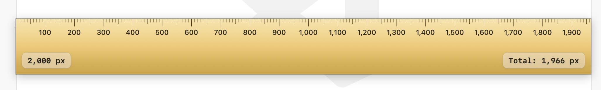

# Ruler

On-screen pixel ruler for macOS.

- Drag the ruler so `0` lines up with your starting point.
- Move your cursor to the target; the readout shows the pixel distance from `0` to the cursor.
- `Esc` or context menu -> Quit (or use `Cmd+Q`).

## Install

Run `install.command`.
